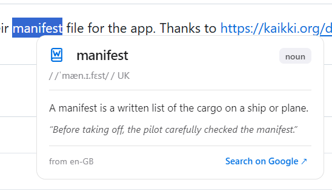
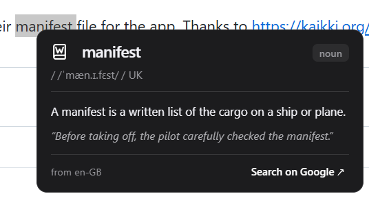
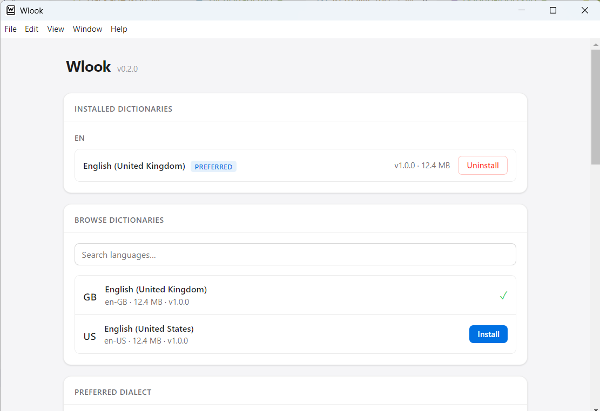
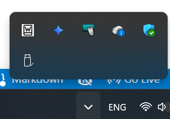

# Wlook

A lightweight Windows companion app that brings macOS-style "Look Up" to any text on Windows.

## Product images

## Credits

- Developed by [Clyde D'Souza](https://clydedsouza.net)
- Dictionary files from [kaikki.org](https://kaikki.org/dictionary/rawdata.html)
- SVG to ICON conversion from [cloudconvert.com](https://cloudconvert.com/svg-to-ico)
